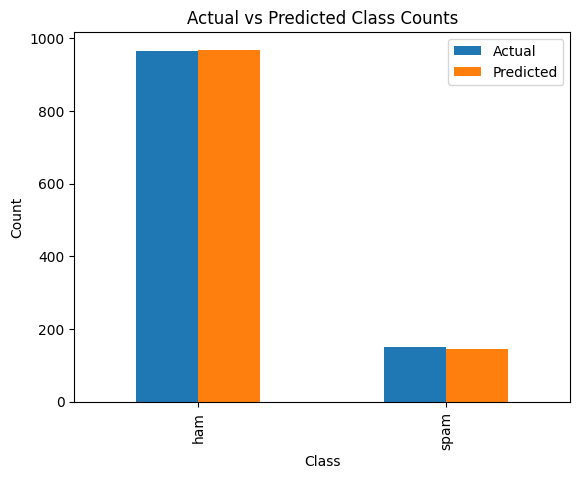

# Spam Detection in SMS Messages

## Project Overview

This project aims to accurately classify SMS messages as 'spam' or 'ham' (non-spam) using supervised machine learning techniques. The motivation behind this project is to demonstrate the application of natural language processing (NLP) and machine learning in a practical, real-world problem of spam detection, which is a common challenge in the field of text analytics.

## Data Description

The dataset used for this project is

a collection of SMS messages labeled as 'spam' or 'ham'. It contains 5,572 messages in English, tagged accordingly based on their content. The dataset is split into training and testing sets to evaluate the performance of the machine learning model.

## Methodology

### Data Preprocessing

The SMS messages were preprocessed to convert text data into a suitable format for analysis. This included:

- Removing all irrelevant characters such as punctuation and numbers.
- Converting all messages to lowercase to ensure uniformity.
- Tokenizing the text into individual words.
- Removing stop words that don't contribute to the spam/ham classification.
- Applying stemming to reduce words to their root form.

### Feature Extraction

The preprocessed text data was then transformed into numerical features using the CountVectorizer from the scikit-learn library, which converts a collection of text documents into a matrix of token counts.

### Model Selection and Training

We chose a Multinomial Naive Bayes classifier for this task due to its suitability for word counts and its effectiveness in document classification tasks. The model was trained using the feature vectors obtained from the CountVectorizer and the corresponding labels from the training data.

## Results and Evaluation

The trained model achieved an accuracy of 98.83% on the test set. The confusion matrix for the model's predictions is as follows:

```
[[961   5]
 [  8 141]]
```

This indicates that out of 1,115 messages in the test set, 961 true 'ham' messages were correctly classified,

5 'ham' messages were incorrectly classified as 'spam', 141 true 'spam' messages were correctly classified, and 8 'spam' messages were incorrectly classified as 'ham'.

The visual representation of the model's performance is shown in the bar chart below, where the actual and predicted class counts are compared..



## Challenges and Learnings

During the project, challenges included handling imbalanced class distribution and choosing the right preprocessing and feature extraction techniques. By experimenting with different approaches and fine-tuning the model parameters, we overcame these challenges and improved the model's accuracy.

Key learnings from this project include gaining a deeper understanding of NLP techniques and the importance of proper data preprocessing. Additionally, this project highlighted the effectiveness of Naive Bayes for text classification tasks.

## Conclusion and Future Work

The project successfully demonstrates the use of machine learning to classify SMS messages as spam or ham. For future work, the model can be improved by experimenting with different machine learning algorithms, tuning hyperparameters, and using advanced NLP techniques such as word embeddings. Another extension could be deploying the model into a production environment where it can filter spam messages in real-time.

## References

- Scikit-learn Documentation
- Python's Natural Language Toolkit (NLTK)__
